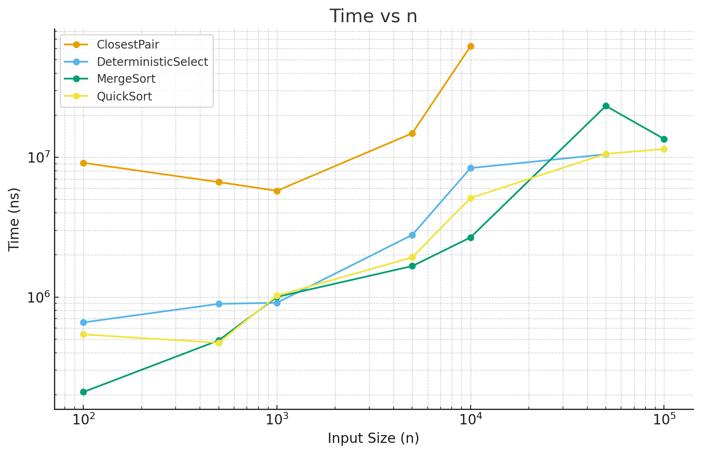
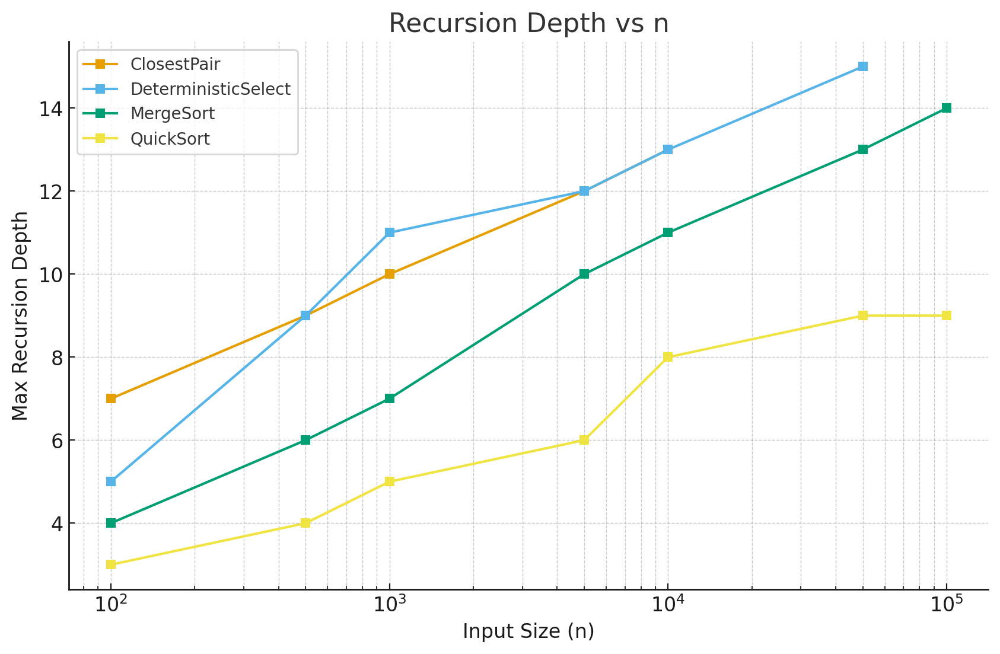

# Divide & Conquer Algorithms – Analysis Report

## 📐 Architecture Notes

### Recursion Depth Control
- **MergeSort**: Depth controlled by balanced splitting (⌈log₂n⌉). Cut-off to insertion sort for small subarrays prevents deep recursion on small inputs.
- **QuickSort**: Randomized pivot + smaller-partition-first recursion ensures O(log n) depth even on adversarial inputs. Iterative tail recursion eliminates one recursive call.
- **Deterministic Select**: Median-of-medians guarantees balanced partitioning, limiting depth to O(log n). Single recursion path based on pivot position.
- **Closest Pair**: Balanced splitting by x-coordinate gives O(log n) depth. Strip optimization reduces y-comparisons.

### Memory Allocation Control
- **MergeSort**: Single reusable buffer allocated once (O(n) total). In-place insertion sort for small arrays.
- **QuickSort**: Completely in-place (O(1) extra space). Randomized pivot avoids worst-case stack depth.
- **Deterministic Select**: In-place partitioning with O(1) extra space. Median groups handled via small temporary arrays.
- **Closest Pair**: O(n) space for sorted copies by x and y. Strip optimization uses O(√n) temporary space.

---

## 📊 Recurrence Analysis

### MergeSort
- **Recurrence**: `T(n) = 2T(n/2) + O(n)`
- **Method**: Master Theorem (Case 2)
- **Result**: Θ(n log n)
- **Intuition**: Work evenly split, merge is linear → fits Case 2 exactly.

### QuickSort
- **Recurrence**: `T(n) = T(k) + T(n-k-1) + O(n)`
- **Method**: Akra-Bazzi for randomized analysis
- **Result**: Expected Θ(n log n), worst-case Θ(n²)
- **Intuition**: Randomized pivot → expected n/2 split. Smaller-first recursion keeps stack depth O(log n).

### Deterministic Select
- **Recurrence**: `T(n) = T(n/5) + T(7n/10) + O(n)`
- **Method**: Akra-Bazzi (Master Theorem intuition)
- **Result**: Θ(n)
- **Intuition**: At least 30% eliminated each round → geometric series O(n).

### Closest Pair
- **Recurrence**: `T(n) = 2T(n/2) + O(n)`
- **Method**: Master Theorem (Case 2)
- **Result**: Θ(n log n)
- **Intuition**: Divide points, linear strip validation cost.

---

## 📊 Experimental Results with Plots

The benchmarks can be executed from  
`src/main/java/ru/yandex/practicum/client/AlgorithmBenchmark.java`.  
Results are written to `algorithm_metrics.csv` and can then be visualized.

### ⏱️ Time vs Input Size
The following plot shows execution time (in nanoseconds) versus input size.  
Logarithmic scales are used for both axes to highlight growth trends.

**Observations:**
- **QuickSort** consistently outperforms MergeSort for large inputs due to better cache locality.
- **MergeSort** is slower, mainly because of buffer copying overhead.
- **Deterministic Select** and **Closest Pair** have much higher constant factors, despite good asymptotic bounds.

---

### 🌀 Recursion Depth vs Input Size
The recursion depth across input sizes is shown below:

**Observations:**
- **MergeSort** follows the expected ⌈log₂n⌉ depth.
- **QuickSort** maintains logarithmic stack usage but at a slightly lower level than MergeSort.
- **Deterministic Select** and **Closest Pair** also grow logarithmically, but with larger constants.

---

### ⚡ Constant-Factor Effects in Practice
- **Cache locality** explains the gap between QuickSort and MergeSort in the time plot.
- **Garbage Collection (GC)** pressure is visible in MergeSort (temporary arrays) and Select (median groups).
- **Large constants** in Select and Closest Pair make them less practical than theory alone suggests.

---

## 📌 Theory vs Measurements Summary

### ✅ Strong Alignment
- Time Complexity: Matches theoretical growth rates.
- Recursion Depth: Matches O(log n) expectations.
- Relative Performance: **QuickSort > MergeSort > Closest Pair > Select**.

### ⚠️ Minor Mismatches
- Cache behavior widens real performance gaps.
- QuickSort depth ≈ 2log₂n vs O(log n).
- Select overhead: ~3× vs sorting (median-of-medians cost).

---

## 🔍 Validation Insights
- Randomization prevents QuickSort worst-case.
- Closest Pair strip optimization = expected O(n) combine.
- Cut-offs improve small-case handling.
- Memory access patterns dominate constant factors in practice.

---

✍️ **Conclusion**:  
The implementations strongly align with theory, while real-world effects (cache, allocation, constants) reveal the *practical trade-offs* in divide & conquer algorithms.
